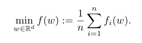
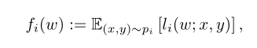
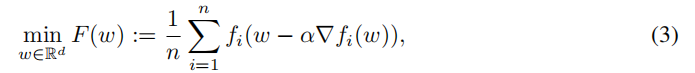
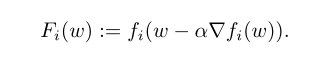
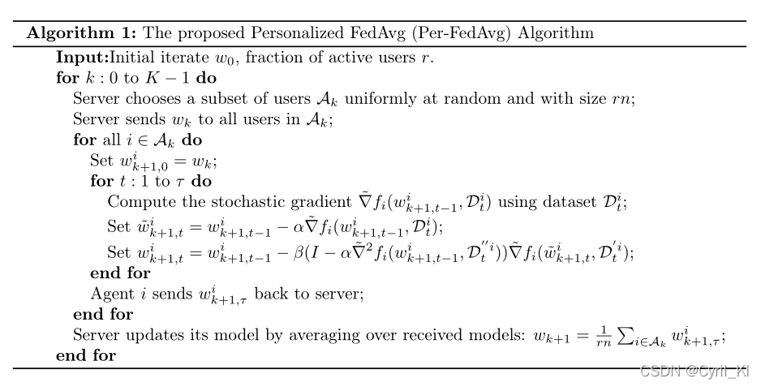
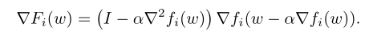
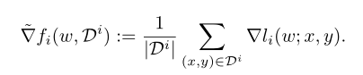

# 联邦学习
联邦学习中，假设有n个客户端，那么其优化函数为：

公式上来看就是最小化客户端的损失函数的均值。对每个客户端来说，损失函数可以定义为

# Loss Function
这个公式的意思是，client在收到初始参数后，先进行若干次梯度下降更新再计算其损失。

优点在于，不仅允许保持FL的优势，同时能捕获用户之间的区别。
对每个客户端，定义他的元函数为

# Algorithm

其中，为了在本地对F(w)进行更新，需要计算其梯度,就是利用上面的meta_function对w求导。

直接对损失函数求导代价很大，因此处理方法是在客户端本地选取一批数据，利用这批数据对梯度进行无偏估计，二阶梯度也如此求。

# 参考资料
[Per-fed-avg](https://blog.csdn.net/Cyril_KI/article/details/123349183)