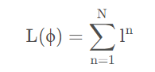
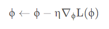
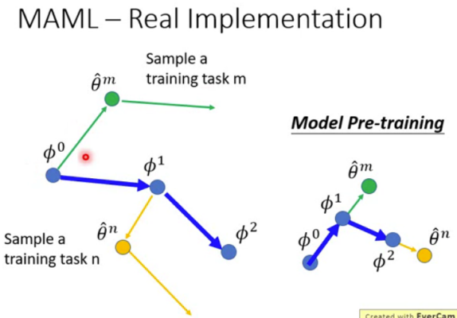
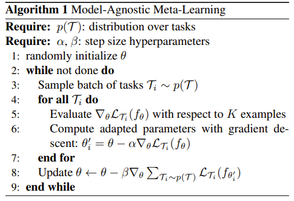

# 参考文章
[解释了元学习和MAML](https://blog.csdn.net/oXiLang/article/details/123372382)

# 元学习概述
元学习的意思是学会学习，在机器学习中最繁琐的工作就是调整参数，如果能让机器自己学会调参，遇到类似的任务也能触类旁通，就能省去大量的人工工作。
元学习的目标是找到一个Function能够让机器自动学习超参数的模型，换句话说————这个Function仅需要很少的训练次数就能达到很好的效果。

# 元学习的训练
元学习的训练单为任务，每个任务里面包含了训练任务和测试任务，训练任务和测试任务内都有训练数据和测试数据。
用于训练的任务的集合称为————支持集，用于测试的任务的集合称为————查询集。
元学习的损失函数如下：

该函数表示所有任务的测试损失值，元学习的目标是找到最优超参数ϕ使得所有任务的测试损失值最小。

# MAML
MAML梯度下降公式如下：

算法如下：
1. 假设刚开始的初始化参数为ϕ_0
2. 随机采用一个训练任务m
3. 通过训练任务m的支持集(训练数据)求得Loss，计算梯度，得到任务m的最优参数θ
4. 在θ的基础上通过任务m的查询集(测试数据)求得Loss，计算梯度，得到元模型更新的梯度方向，将该方向作用于元模型上
5. 回到第二步，重复进行。

# MAML原文的算法
首先先随机采样一个batch的训练任务(注意，不是数据),对于一个batch里的所有任务，通过第5行求梯度，第6行根据第5行的梯度更新一次参数并且保存。完成一个batch的所有任务的参数更新之后。进行第8行，基于更新后的参数，通过查询集计算出loss，通过loss求梯度，利用梯度更新参数,将loss求和并基于求和结果计算梯度,利用梯度更新元模型参数。

！