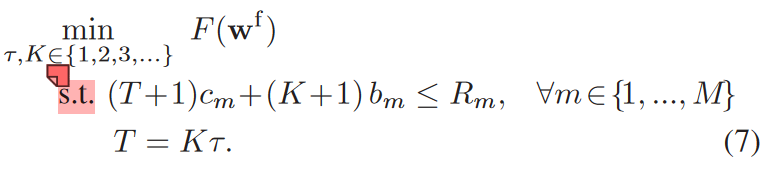

# 目标函数
F(wf)指联邦学习中的全局损失函数;
s.t.指服从于;
T代表某节点总的本地计算次数。
K代表某节点在两次本地计算中间参数全局更新的次数。
作者假设每个节点的每次本地计算消耗的能源数都一样。

c_m指一次本地计算消耗的能源数
b_m指一次全局更新消耗的能源数

# 为了解决上述目标函数的问题，需要找到T、K如何影响损失函数
但是通常来说很难找到一个数学表达式同时联系tao、K、Fw，因为这取决于梯度下降的收敛性和全局聚合频率对收敛的影响。
作者首先分析了联邦学习的分布式梯度下降的收敛界，然后使用这个收敛界去近似的解决上述提到的问题描述,并且提出一个控制算法来选择最优的tao和T来达到资源利用的最优。