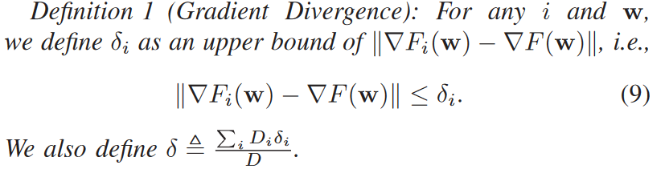

# title
Adaptive Federated Learning in Resource Constrained Edge Computing Systems
# 目标函数
F(wf)指联邦学习中的全局损失函数;
s.t.指服从于;
T代表某节点总的本地计算次数。
K代表某节点在两次本地计算中间参数全局更新的次数。
作者假设每个节点的每次本地计算消耗的能源数都一样。

c_m指一次本地计算消耗的能源数
b_m指一次全局更新消耗的能源数

# 为了解决上述目标函数的问题，需要找到T、K如何影响损失函数
但是通常来说很难找到一个数学表达式同时联系tao、K、Fw，因为这取决于梯度下降的收敛性和全局聚合频率对收敛的影响。
作者首先分析了联邦学习的分布式梯度下降的收敛界，然后使用这个收敛界去近似的解决上述提到的问题描述,并且提出一个控制算法来选择最优的tao和T来达到资源利用的最优。
这个控制算法在每一次全局聚合中，都基于最近一次的系统状态(node发送给server.)重新计算tao(下一次node本地计算的次数).

# 找到全局参数的收敛界
第一步找到在每轮迭代中本地迭代的参数和全局参数的距离
第二步找到每轮迭代中本地迭代的参数的收敛界
将上述两步结合就得到了全局的收敛界

## 梯度分歧
作者定义了一个梯度分歧，该**梯度分歧与数据在不同的节点如何分布**有关。
