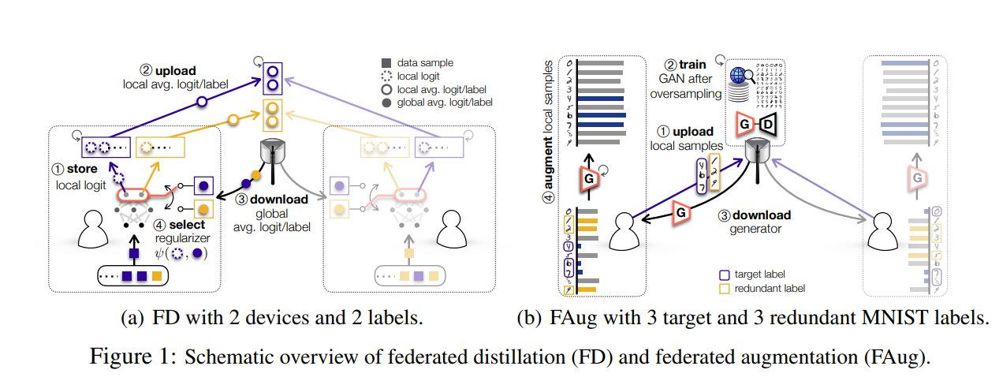

# 研究目标
异质异构联邦元学习，主要涉及学习过程的*收敛性*、*隐私性*

# FML面临的挑战
+ 参与设备的数量可能有成千上万台，一个低效的设备选择算法会导致全局模型收敛速度降低。
(12-14)有几篇文章提出了联邦学习收敛的设想，但不能直接应用于FML。
+ 面对真实情况，FML与设备的一些时间有强关联，比如计算时间、通信时间等。
+ 由于FML在本地训练中涉及高阶信息（可能是梯度）和有偏差的随机梯度下降，因此现有的FL加速方法很难应用在FML中。

# FML的数学分析
+ “A collaborative learning framework via federated meta-learning,”
+ “Personalized federated learning with theoretical guarantees: A model-agnostic meta-learning approach,”
+ “Inexact-ADMM based federated meta-learning for fast and continual edge learning,”

# 设备选择研究paper
## Client selection for federated learning with heterogeneous resources in mobile edge

## Fast-convergent federated learning

## A joint learning and communications framework for federated learning over wireless networks

## J. Ren, G. Yu, and G. Ding Accelerating DNN training in wireless federated edge learning systems
引入batchsize选择设备的方法来加速联邦学习过程

## [29](./source/../adaptive_fed.md)Adaptive Federated Learning in Resource Constrained Edge Computing Systems
0. 作者提出一种控制算法，在给定一个已知的资源预算的情况下，利用该控制算法在本地更新和全局参数聚合之间作出最优权衡(就是在每轮算法中实时调整tao的值),该权衡的目的是在资源有限的情况下最小化损失函数。
1. tao是指两次全局之间的本地迭代轮次

## EFFICIENT FEDERATED META-LEARNING OVER MULTI-ACCESS WIRELESS NETWORKS
0. 作者首先通过FML的几个假设，证明了通过三个批次数据来对损失函数的一阶、二阶梯度进行估计得到的元函数梯度估计是一个有偏估计。
1. 作者提出一种非随机的设备选择算法NUFM，来提高原始联邦元学习的收敛效率，在设备选择算法中每个设备需要计算贡献度，把贡献度传回server进行排序，选择贡献度大的设备参与计算，设备贡献度的计算涉及某些未知参数的估计，作者参考文章[29]在训练过程中对参数进行估计。
2. 基于NUFM提出一种资源分配策略URAL，在真实无线网络场景下联合地优化收敛速度、设备钟点时间、能量消耗。
3. 更详细的，作者量化了每个设备对于全局模型收敛的贡献，通过*得出在一轮中全局损失减少的下界*。
4. 老板更关注异步性，比如***贡献度的消息如果异步到达，会如何处理***？
5. 未来的作品会探索 联邦元学习中的本地更新和全局聚合来最小化收敛时间和能源消耗;或者降低NUFM的通讯复杂度和特化收敛性质。

### 想法
假设有几个贡献度一直很大的client，总是参与了参与训练的过程，那么全局模型就朝着该些client期望的方向前进，而较低贡献度的模型没有得到想要的优化效果，这似乎不符合FL的初衷(所以是否需要引入概率？--drop out.)

# 去中心化联邦学习、蒸馏学习
## Decentralized and Model-Free Federated Learning: Consensus-Based Distillation in Function Space
0. 老板让我关注这篇文章的收敛性分析
1. 该文章首先提出一个去中心化的联邦学习的算法框架，在函数空间下对该算法框架进行收敛性分析，然后将蒸馏学习的算法应用在该算法框架上。
2. 有借鉴之处的地方：1. 收敛性分析 2. 蒸馏学习的思想
   + 收敛性分析：在该篇文章里面，收敛的分析主要分为两步：1. 获取本地设备的损失函数，计算他们的平均损失函数的均值，和每个本地设备到这个均值函数之间的距离的上界 2. 考虑当t（迭代次数）趋于无穷时，这个均值函数的上界。
   + 蒸馏学习的思想:在训练开始时，各个节点先达成一个公共数据集的共识，在各个节点训练完模型后，计算该公共数据集中的(x, F(x)), 将(x,F(x))传给邻居节点，然后邻居节点利用(x,F(x))使用蒸馏学习的思想对本地模型进行改进。

## Inexact-ADMM Based Federated Meta-Learning for Fast and Continual Edge Learning(基于ADMM联邦元学习收敛分析)
+ 边缘学习面临的两个挑战 1. 收敛速度 2. 对先前模型的遗忘
+ 为了能够解决对先前模型遗忘的问题，作者在传统的联邦元学习函数的基础上增加了一个正则项（用布雷格曼散度衡量当前模型参数和上一轮的模型参数之间的散度）。原来的问题就转化为了带有约束条件的优化问题。
+ 作者使用增广的拉格朗日函数描述该优化问题，并利用ADMM算法来解决该优化问题
+ ADMM算法是一种解决可分解优化问题的方法，可以将原来的方法分解为多个子问题来并行求解。ADMM算法相对于SGD收敛速度较慢，ADMM主要用于解空间较大的问题上。

## HFedMS: Heterogeneous Federated Learning with Memorable Data Semantics in Industrial Metaverse
+ 本篇文章将联邦学习应用在工业元宇宙的背景下，见[元宇宙相关](metaverse.md)
+ 作者首先利用了聚类的思想，根据不同客户端的分布聚成多类。
+ 然后在根据这些类别，构造训练分组，达到“组内异构，组间同构，组内顺序训练，组间平行训练”的效果

## Optimizing Federated Learning on Non-IID Data with Reinforcement Learning
+ 使用强化学习中的经验总结来为选择每轮参与训练的设备

## Adaptive Federated Optimization
+ 提升模型在非独立同分布数据下的收敛性

# 联邦学习分组策略
## Heterogeneous federated learning via grouped sequential-to-parallel training

## Data heterogeneity-robust federated learning via group client selection in industrial iot

## Fedgs: A federated group synchronization framework for heterogeneous data

## 数据增强的思路
### Communication-Efficient On-Device Machine Learning: Federated Distillation and Augmentation under Non-IID Private Data
作者将联邦蒸馏和GAN结合，在训练全局模型的基础上，再多训练一个全局GAN模型：1.用户首先上传本地样本的输入输出 2.利用GAN进行重新采样，训练一个全局GAN 3.用户下载GAN模型，利用该GAN模型进行本地数据增强，目标是将本地的non iid数据填充为iid数据。 4. 将数据用于本地模型训练 5. 上传新的输入输出label给server 6. 服务器训练后然后用户下载更新本地模型

# 想法
+ 异质异构是指每个client的模型层数、参数数量可能不同，有没有办法找到一种能够衡量模型的方法（包括层数、参数数量）,确实感觉对于异质异构，使用蒸馏学习会是一个比较好的方法。
+ gossip 学习 + 联邦蒸馏学习（指定一个全局数据集，只发送X和y），结合起来就是向周围的节点广播X和y
+ gossip 学习 + 联邦元学习？
+ 将贡献度的思想映射为权重，为每个设备的梯度赋自适应的动态权重。
+ GAN+联邦蒸馏，将本地Client的模型作为判别器，另外训练一个生成器，将生成器生成的数据“分布”（或者输入输出）传给server，server整合数据进行训练。
+ 利用强化学习来训练联邦元学习的分组策略。
+ 针对流式数据来优化联邦元学习？（流式学习——数据降维）