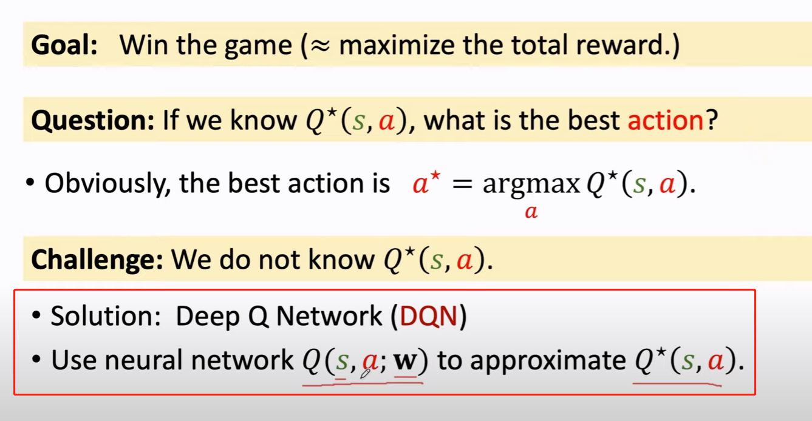

# 强化学习的基本术语
## 状态
比如说游戏中的某个时刻，如下图

## 动作
比如说图中马里奥可以进行的动作：1.往上跳 2.往左走 3.往右走
## 智能体
马里奥可以看作是一个智能体
## 策略policy
π是一个概率密度函数，给定状态s，π会输出概率分布，如马里奥中向左走的概率，向右走的概率，向上跳的概率。

π就是强化学习中需要训练的目标函数。
## 奖励reward
reward R是一个奖励函数，如在马里奥游戏中，收集到一个金币奖励+1，赢得游戏奖励+10000.马里奥被乌龟打到，奖励-10000.无事发生，奖励+0。

## 状态转移state transition
比如马里奥跳了一下，此时马里奥的状态发生了变化，就称为状态转移。

## 使用强化学习训练的过程
1. 观测游戏中的一个帧frame1
2. π作出一个动作决策a1
3. 观测游戏中的新一帧frame2和奖励reward1
4. π作出一个动作决策a2
5. ...以此不断循环
(state, action, reward)一个序列为：s1,a1,r1,s2,a2,r2...

## return回报函数
+ 定义：return回报函数就是未来奖励的求和
但是，必须考虑到奖励的时效性。如现在获得100块和明年获得100块，理性人都会选择现在获得100块。因此在第一个奖励以后的每个奖励都会要乘以一个折扣率参数γ

+ return回报函数也是个随机变量，由于Reward取决于同一时刻的动作action和状态state，因此reward也具有随机性。

+ ***在t时刻并不能观测return的值，因为t+1,t+2都是未知***

## 动作价值函数
+ 动作价值函数，用来衡量某个时刻该动作的价值
+ 上面说到，return函数在t时刻不能被观测，并且return函数是一个随机变量，因此我们对reutrn函数求期望，即对未来状态和对未来的动作求积分(但不包括t时刻的动作和状态)，就得到了动作价值函数Q,并且动作价值函数Q与不同的π函数有关，用不同的π函数会有不同的Q取值。

## 最优动作价值函数-optimal action-value function
对t时刻所有π函数，取其中动作价值函数最大的一个，即为optimal action value function.

## 状态价值函数
+ 状态价值函数用来衡量某个时刻的状态，评价当前状态的好坏。
状态价值函数即对动作价值函数中的a求期望————目的是消去a。

## DQN
Q(s,a,w)中state是状态、action是动作、weight是DQN中的参数，DQN使用神经网络去近似一个最优的Q_star。Q_star会给当前状态所有可能的动作打分，随着训练次数的不断增加，打分会越来越准确。

## TD算法————学习DQN最常用的算法
1. 观测当前状态S_t和动作A_t
2. 预测价值 q_t = Q(s_t, a_t; w_t)
3. 对Q关于w_t求导，得到d_t
4. 环境更新状态s_t,并且给出奖励r_t
5. 计算TD-target y_t
6. 对w_t做一次梯度下降的更新得到w_t+1

## 参考视频
[深度强化学习(2/5)：价值学习 Value-Based Reinforcement Learning
](https://www.youtube.com/watch?v=jflq6vNcZyA)